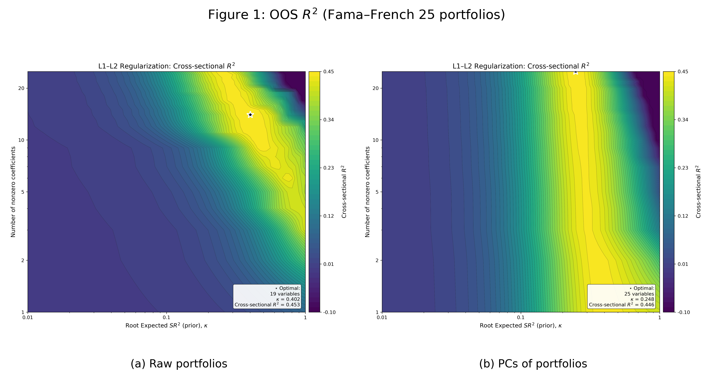
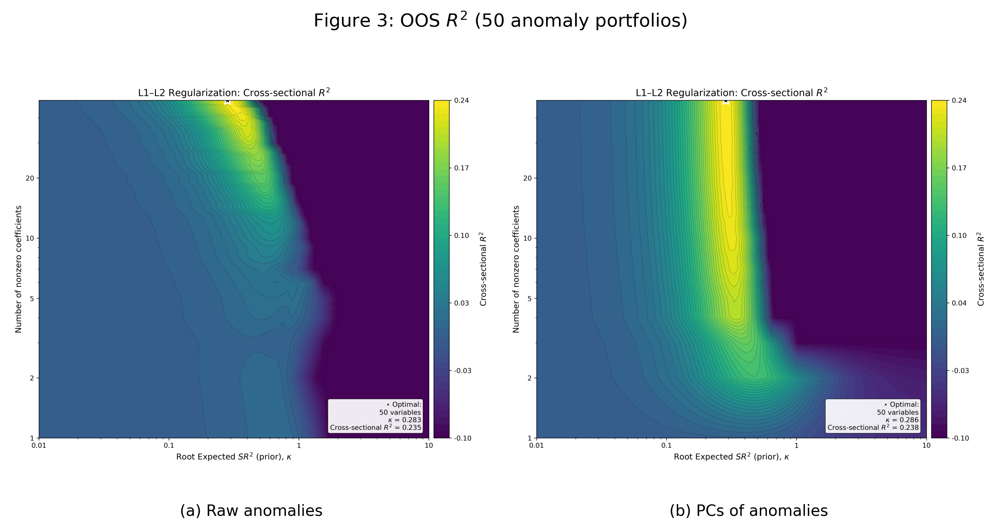

# Shrinking the Cross Section — Python Replication

This repository replicates the results from:

> **Serhiy Kozak, Stefan Nagel, Shrihari Santosh (2020).**  
> *Shrinking the Cross-Section*, *Journal of Financial Economics*, 135(2), 271–292.  
> [https://doi.org/10.1016/j.jfineco.2019.06.008](https://doi.org/10.1016/j.jfineco.2019.06.008)

It implements the estimators and replication code in Python, aiming to maintain numerical equivalence with the original MATLAB version available at [github.com/serhiykozak/SCS](https://github.com/serhiykozak/SCS).

The replication covers:
- **Fama–French 25 portfolios** (double-sorted by Market Equity × Book-to-Market)  
- **50 anomaly portfolios**

The unified pipeline reproduces:
- *Table 1* (largest SDF factors from ridge regression)  
- *Table 4* (out-of-sample α statistics)  
- *Figures 1–4* (L² model selection, sparsity, and OOS R² contours)

All artifacts are generated automatically via:

```bash
python make_readme_artifacts.py
```

---

## Replication Figures

All figures are stored in the local `/paper_figures/` directory.

### **Figure 1 – OOS $R^2$ (Fama–French 25 portfolios)**


### **Figure 2 – L² Model Selection and Sparsity (FF25 portfolios)**


### **Figure 3 – OOS $R^2$ (50 anomaly portfolios)**


### **Figure 4 – L² Model Selection and Sparsity (50 anomaly portfolios)**


---

## Tables

### **Table 1 – Largest SDF factors (50 anomaly portfolios)**  
_Coefficient estimates and absolute t-statistics at the optimal prior root expected SR² (cross-validated)._

**(a) Raw 50 anomaly portfolios**

| Portfolio | b | t |
| --- | --- | --- |
| r_indrrevlv | -0.879 | 3.527 |
| r_indmomrev | 0.484 | 1.945 |
| r_indrrev | -0.425 | 1.705 |
| r_season | 0.322 | 1.292 |
| r_sue | 0.323 | 1.291 |
| r_valprof | 0.297 | 1.184 |
| r_rome | 0.299 | 1.183 |
| r_inv | -0.238 | 0.948 |
| r_roe | 0.238 | 0.947 |
| r_ciss | -0.239 | 0.947 |
| r_mom12 | 0.227 | 0.906 |

**(b) PCs of 50 anomaly portfolios**

| Portfolio | b | t |
| --- | --- | --- |
| PC4 | 1.014 | 4.249 |
| PC1 | -0.537 | 3.081 |
| PC2 | -0.556 | 2.653 |
| PC9 | 0.635 | 2.514 |
| PC15 | -0.324 | 1.265 |
| PC17 | 0.303 | 1.182 |
| PC6 | -0.287 | 1.176 |
| PC11 | 0.189 | 0.745 |
| PC13 | 0.166 | 0.654 |
| PC23 | 0.146 | 0.564 |
| PC7 | -0.140 | 0.561 |

---

### **Table 4 – Out-of-sample performance summary (2005–2017)**  
_MVE portfolio’s annualized OOS α in the withheld sample (%)._

| SDF factors | CAPM (α %) | FF6 (α %) | Char-sparse (α %) | PC-sparse (α %) |
| --- | ---: | ---: | ---: | ---: |
| 50 anomaly portfolios | 14.07 | 8.05 | 11.76 | 4.19 |
| (s.e.) | ( 5.26 ) | ( 4.49 ) | ( 4.36 ) | ( 1.97 ) |

---

## Setup

Clone the repository and install dependencies:

```bash
git clone https://github.com/AntoineNaly/Shrinking_the_cross_section_JFE2020_Python_Replication.git
cd Shrinking_the_cross_section_JFE2020_Python_Replication
pip install -r requirements.txt
```

Then run the replication pipeline:

```bash
python make_readme_artifacts.py
```

Single charts will appear in `/results_export/`, combined charts in `/paper_figures/`.

---

## Notes

- Exact replication of Figures 1 to 4, and Table 1 from the original paper.  
- Table 4 replication exact for CAPM benchmark, close for FF6 and sparse variants.  
- Numerical equivalence maintained with the MATLAB version, subject to data availability: we do not have access to WRDS financial ratios and cannot interact variables due to missing access to fundamental data at the stock level.
- We use the returns shared by the authors for the Fama-French 25 portfolios and the 50 anomalies portfolio, which are available in the `/Data/` folder
- The main orchestrator file is SCS_main.py in the `/v1code/` folder. From here users can run their own version of the paper's methodology, changing portfolios (FF25 or anomalies), dates, holdout sample, etc.

---

© 2025 Antoine Naly — for research and educational use only.
