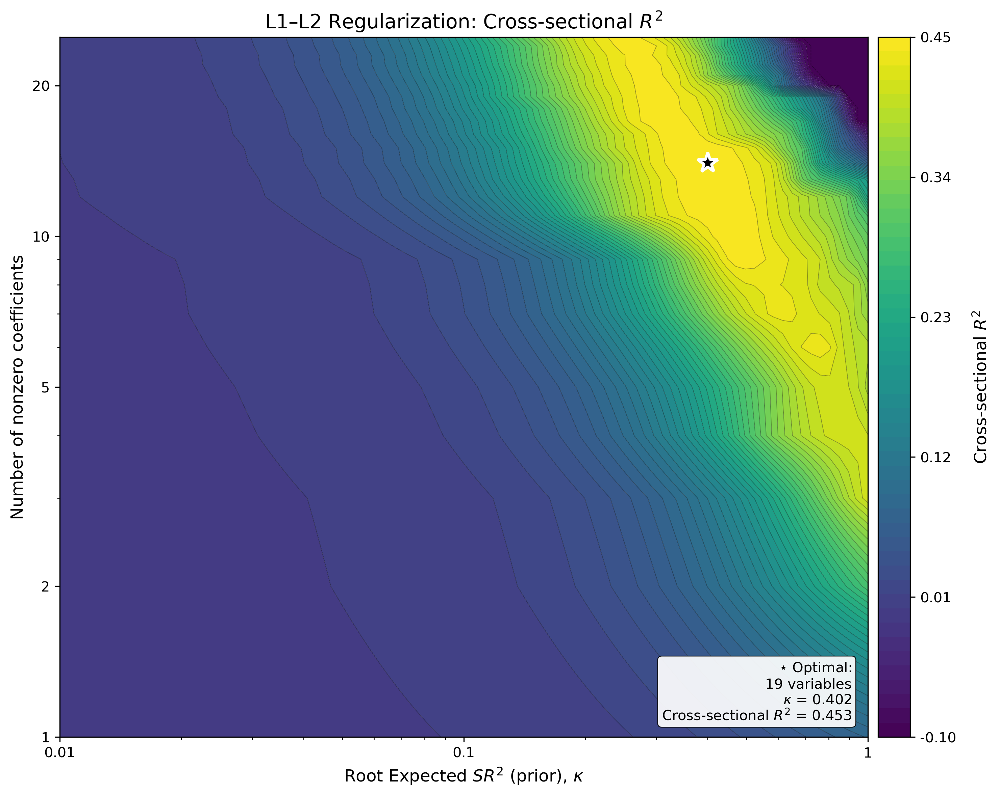
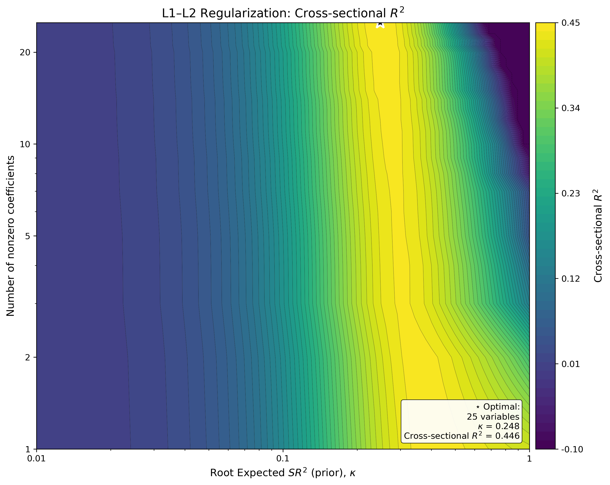
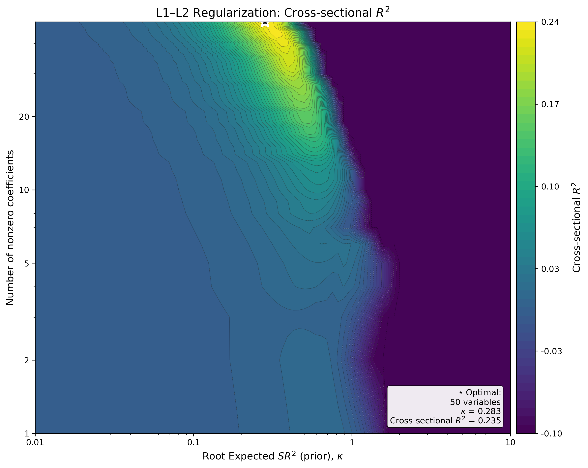
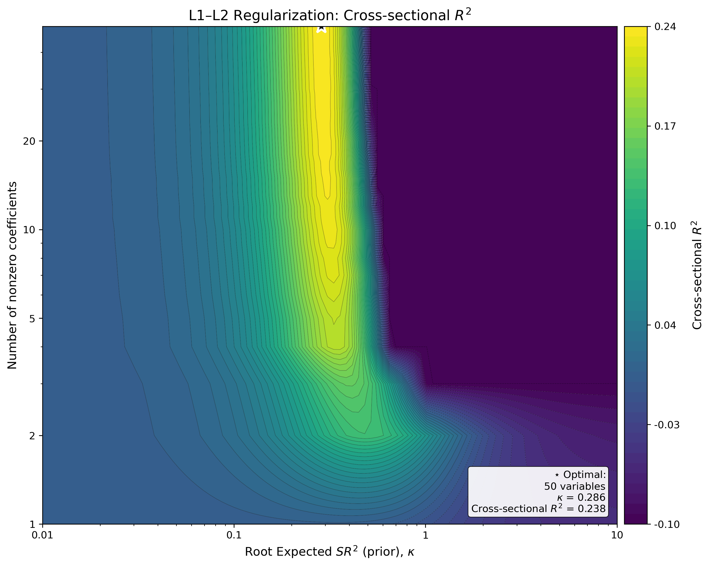

\# Shrinking the Cross Section — Python Replication


This repository replicates the results from:


> Serhiy Kozak, Stefan Nagel, Shrihari Santosh, Shrinking the cross-section, Journal of Financial Economics, Volume 135, Issue 2, 2020, Pages 271-292, ISSN 0304-405X, https://doi.org/10.1016/j.jfineco.2019.06.008.


It implements the estimators and replication code in Python, starting from the authors' data and MATLAB code available at https://github.com/serhiykozak/SCS

Table 1 from the paper based on L2 (ridge) estimation is exactly replicated, and contour plots based on elastic-net like estimation are exactly replicated for both:
- The portfolio of 25 Fama French Book-to-Market and Market Equity portfolios
- The 50 anomaly portfolios

Table 4 was exactly replicated for the CAPM benchmark (absolute market-adjusted returns) and approximately reproduced for Fama-French 6-factor, characteristic-sparse, and PC-sparse benchmarks. Tables and figures are included below.

## Key Figures

### FF25 raw portfolios


### FF25 principal components


### Anomaly-50 raw portfolios


### Anomaly-50 principal components



## Tables

Table 1 (a): Largest SDF factors (50 anomaly portfolios) 
| Portfolio | b | t_stat |
| --- | --- | --- |
| r_indrrevlv | -0.88 | 3.53 |
| r_indmomrev | 0.48 | 1.94 |
| r_indrrev | -0.43 | 1.70 |
| r_season | 0.32 | 1.29 |
| r_sue | 0.32 | 1.29 |
| r_valprof | 0.30 | 1.18 |
| r_rome | 0.30 | 1.18 |
| r_inv | -0.24 | 0.95 |
| r_roe | 0.24 | 0.95 |
| r_ciss | -0.24 | 0.95 |
| r_mom12 | 0.23 | 0.91 |

Table 1 (b): Largest SDF factors (PCs of 50 anomaly portfolios) 
| Portfolio | b | t_stat |
| --- | --- | --- |
| PC4 | 1.01 | 4.25 |
| PC1 | -0.54 | 3.08 |
| PC2 | -0.56 | 2.65 |
| PC9 | 0.63 | 2.51 |
| PC15 | -0.32 | 1.27 |
| PC17 | 0.30 | 1.18 |
| PC6 | -0.29 | 1.18 |
| PC11 | 0.19 | 0.74 |
| PC13 | 0.17 | 0.65 |
| PC23 | 0.15 | 0.56 |
| PC7 | -0.14 | 0.56 |


Table 4: MVE portfolio’s annualized OOS α in the withheld sample (2005-2017), %
| SDF factors              | CAPM (α, %) | FF6 (α, %) | Char.-sparse (α, %) | PC-sparse (α, %) |
|--------------------------|------------:|-----------:|--------------------:|-----------------:|
| 50 anomaly portfolios    |  14.07 |   8.05 |  11.76 |   4.19 |
| (s.e.)                   | (  5.26) | (  4.49) | (  4.36) | (  1.97) |

---


\## Setup


Clone the repo and install dependencies:


```bash

git clone https://github.com/AntoineNaly/Shrinking\_the\_cross\_section\_JFE2020\_Python\_Replication.git

cd "Kozak, Nagel and Santosh, Shrinking the Cross Section (JFE 2020) Python Replication"

pip install -r requirements.txt


